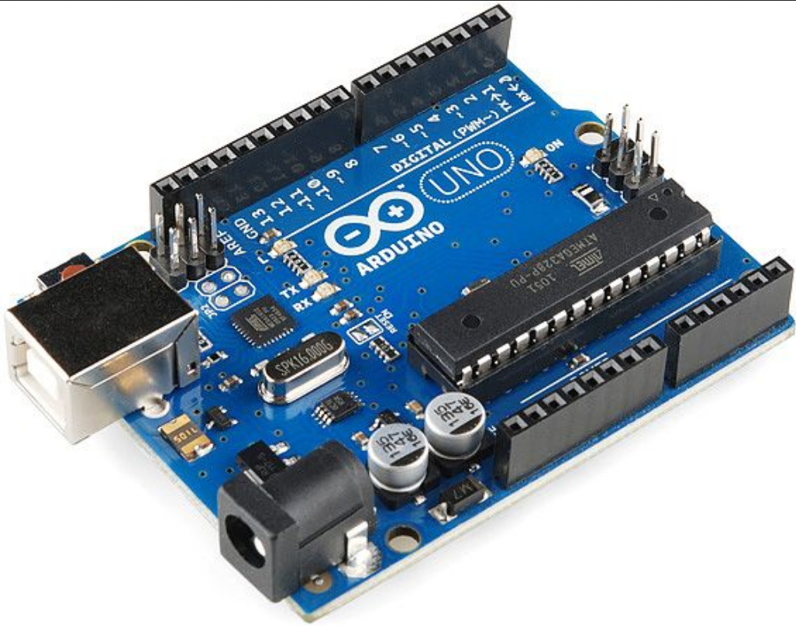
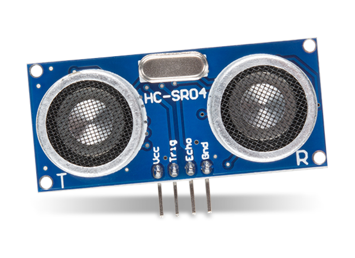
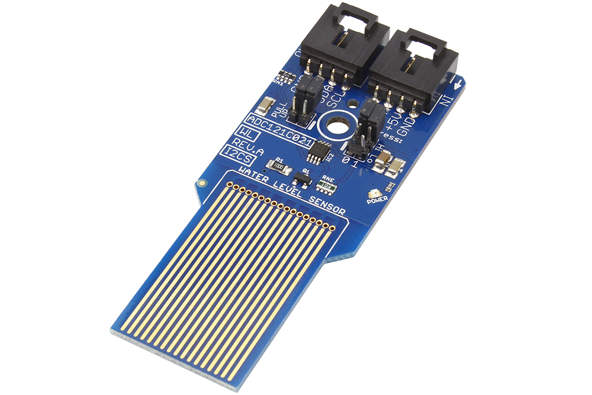
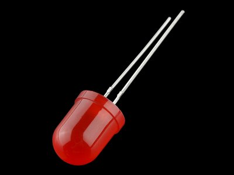
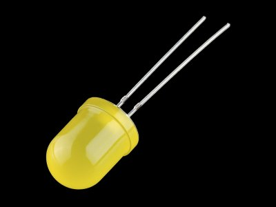
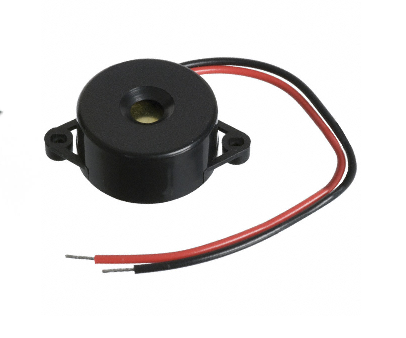
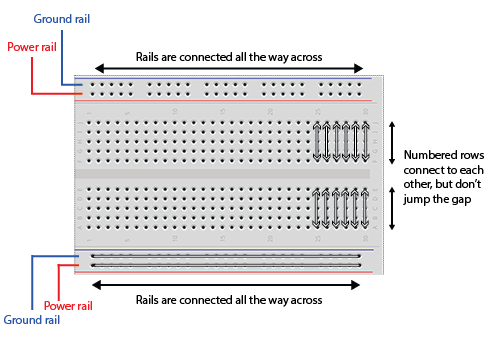
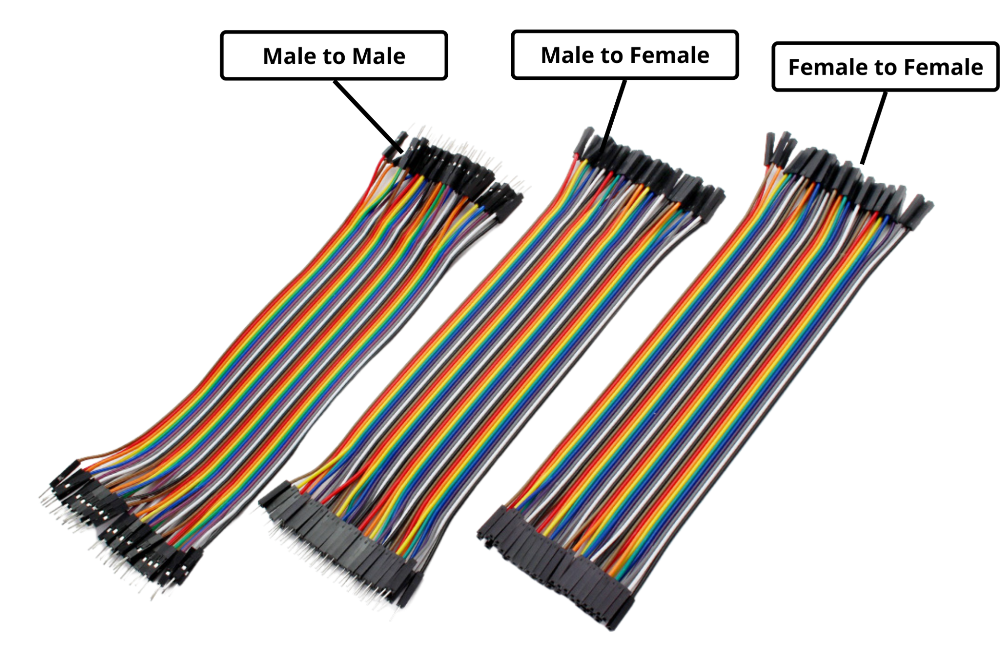
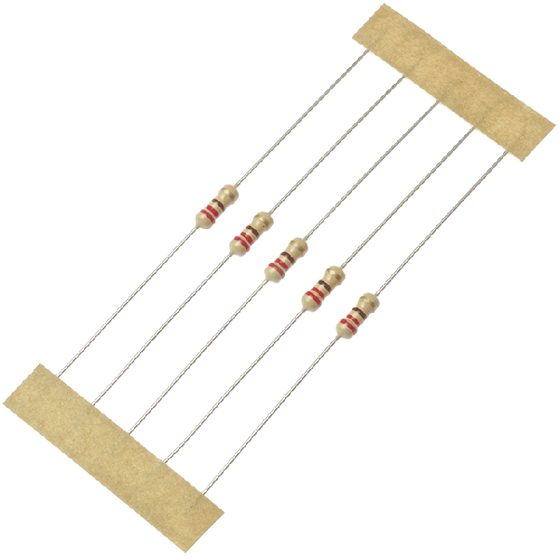

# Arduino Smart Alert System

This project is a smart Arduino-based alert system that integrates three types of sensors: ultrasonic distance, PIR motion, and a water level sensor. It uses LEDs and a buzzer to alert users of varying conditions in the environment.

## Features

- Red & Yellow LEDs for visual feedback
- Buzzer for dynamic audible alerts
- PIR Sensor to detect movement
- Ultrasonic Sensor to detect proximity
- Water Sensor to detect water level

---

## Requirements

- Arduino Uno (or compatible)
- PIR Sensor
- Ultrasonic Sensor (HC-SR04)
- Analog Water Sensor
- Red & Yellow LEDs
- Buzzer
- Resistors (2x 220Ω for LEDs)
- Breadboard + Jumper wires

---

## Components Overview (Visual Guide)
> Here’s a quick look at each component used in this project so you know exactly what you're working with.

<table>
  <tr>
    <th>Component</th>
    <th>Image</th>
    <th>Description</th>
  </tr>

  <tr>
    <td><strong>Arduino Uno</strong></td>
    <td></td>
    <td>Main microcontroller that runs the entire system and connects to all sensors and outputs.</td>
  </tr>

  <tr>
    <td><strong>PIR Sensor</strong></td>
    <td></td>
    <td>Detects motion through infrared signals. Triggers the buzzer when movement is detected.</td>
  </tr>

  <tr>
    <td><strong>Ultrasonic Sensor (HC-SR04)</strong></td>
    <td></td>
    <td>Measures the distance of nearby objects using sound waves. Used for proximity detection.</td>
  </tr>

  <tr>
    <td><strong>Analog Water Sensor</strong></td>
    <td></td>
    <td>Senses water levels through conductivity. Classifies as Dry, Medium, or High.</td>
  </tr>

  <tr>
    <td><strong>Red LED</strong></td>
    <td></td>
    <td>Indicates danger or high alert conditions (e.g., motion or high water level).</td>
  </tr>

  <tr>
    <td><strong>Yellow LED</strong></td>
    <td></td>
    <td>Signals caution states like medium water levels or distant objects.</td>
  </tr>

  <tr>
    <td><strong>Buzzer</strong></td>
    <td></td>
    <td>Outputs different sound patterns based on the detected sensor condition.</td>
  </tr>

  <tr>
    <td><strong>Breadboard</strong></td>
    <td></td>
    <td>Used to prototype the circuit without soldering. Connects all components together.</td>
  </tr>

  <tr>
    <td><strong>Jumper Wires</strong></td>
    <td></td>
    <td>Connects components to the Arduino and to each other via the breadboard.</td>
  </tr>

  <tr>
    <td><strong>220Ω Resistors</strong></td>
    <td></td>
    <td>Limits current to LEDs to prevent burning them out. One per LED is recommended.</td>
  </tr>
</table>

---

## Logic Overview

| Sensor Type      | Condition                        | Response                                        |
|------------------|----------------------------------|-------------------------------------------------|
| **Ultrasonic**   | Very close `(distance<10)`       | Red + Yellow ON, long buzzer beep               |
|                  | Medium `(10<=distance<=20)`      | Red ON, medium buzzer beeps                     |
|                  | Far `(distance>200)`             | Yellow ON, short buzzer beeps                   |
| **PIR Motion**   | Motion detected                  | Red ON, high-pitch alarm pattern                |
| **Water Sensor** | High water level                 | Red ON, long buzzer beep                        |
|                  | Medium water level               | Yellow ON, short buzzer beeps                   |
|                  | Dry                              | All OFF                                         |

---

## Wiring Table

| Component          | Arduino Pin | Breadboard Note                             |
|--------------------|-------------|---------------------------------------------|
| **Red LED**        | D7          | Connect through 220Ω resistor to GND rail   |
| **Yellow LED**     | D6          | Connect through 220Ω resistor to GND rail   |
| **Buzzer**         | D8          | Connect + to D8, - to GND rail              |
| **Ultrasonic TRIG**| D3          | Connect directly                            |
| **Ultrasonic ECHO**| D4          | Connect directly                            |
| **PIR Sensor OUT** | D2          | Connect directly                            |
| **Water Sensor**   | A0          | VCC to 5V, GND to GND, Signal to A0         |
| **All GNDs**       | GND         | Connect all to ground rail of breadboard    |
| **Power**          | 5V          | Use 5V pin to power sensors and breadboard  |

---

## How to Use

1. Upload the included Arduino code to your Uno board using the Arduino IDE.
2. Connect components according to the wiring table and Fritzing diagram.
3. Open Serial Monitor (9600 baud) to view live sensor readings.
4. Observe the buzzer and LEDs respond to motion, proximity, and water level.

---

## Contact

> Website: [rashaalsaleh.com](https://rashaalsaleh.com) | Email: [rasha.k.alsaleh@gmail.com](mailto:rasha.k.alsaleh@gmail.com) | LinkedIn: [@rasha-alsaleh](https://www.linkedin.com/in/rasha-alsaleh/)